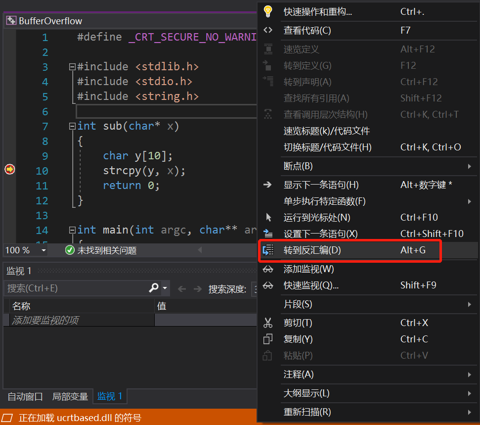
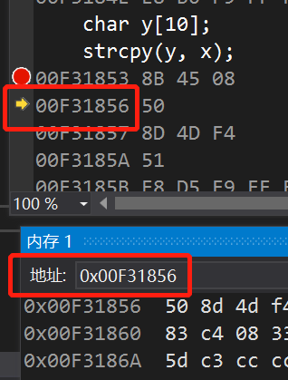

# 缓冲区溢出漏洞实验

### 实验环境

- Visual Studio 2019

### 缓冲区溢出原理

- 缓冲区是一块连续的计算机内存区域，可保存相同数据类型的多个实例。
- 缓冲区可以是堆栈（自动变量）、堆（动态内存）和静态数据区（全局或静态）。
- 溢出指数据被添加到分配给该缓冲区的内存块之外。

### 栈帧

- 每一次函数的调用，都会在调用栈（call stack）上维护一个独立的栈帧（stack frame）。
- 每个独立的栈帧一般包括：
  1. 函数的参数
  2. 函数的返回地址
  3. 函数调用的上下文
  4. 临时变量（包括函数的非静态局部变量和编译器自动生成的其他临时变量）

- 栈帧用 ebp 和 esp 这两个寄存器来划定范围：ebp 指向当前的栈帧底部（称为帧指针），esp 指向当前的栈帧顶部（称为栈指针）。

### 函数调用

- 在调用过程中，有函数调用者（caller）和被调函数（callee）。

- 调用者需要知道被调函数返回值，被调函数需要知道传入参数和返回地址。

- 函数调用的步骤：

  1. 参数压栈；

  2. 返回地址入栈（将下一条指令的地址入栈，供函数返回时继续执行）；

  3. 代码跳转（代码区跳转到被调函数的入口）；

  4. 栈帧调整：

     将调用者的 ebp 压栈，保存指向栈底的 ebp 的地址，esp 指向新栈顶（push ebp）；

     将当前栈帧切换到新栈帧（esp 的值装入 ebp，更新栈帧底部），这时 ebp 指向栈顶，此时栈顶就是 old ebp（mov ebp,esp）；

     给新栈帧分配空间（sub esp,xxx）。

### 函数返回

- 函数返回的步骤：
  1. 保存被调函数的返回值到 eax 寄存器中（mov eax,xxx）；
  2. 恢复 esp 的同时，回收局部变量空间（mov ebp,esp）；
  3. 将上一个栈帧底部位置恢复到 ebp（pop ebp）；
  4. 弹出当前栈顶元素，从栈中取到返回地址，并跳转到该位置（ret）。

### 实验过程

- 新建 .c 文件，输入以下代码：

  ```
  #define _CRT_SECURE_NO_WARNINGS //定义宏，删掉的话编译无法通过
  
  #include <stdlib.h>
  #include <stdio.h>
  #include <string.h>
  
  int sub(char* x)
  {
  	char y[10];
  	strcpy(y, x); //这个函数有安全性问题，所以要添加宏
  	return 0;
  }
  
  int main(int argc, char** argv) //命令行参数
  {
  	if (argc > 1)
  		sub(argv[1]);
  	printf("exit");
  }
  ```

- 使用 Visual Studio 2019 将该 .c 文件添加到解决方案里，并按照如下操作进行配置：

  1. 右键单击解决方案，选择“属性”；

  2. 打开 C/C++ 下的“代码生成”界面，将“启用C++异常”、“基本运行时检查”、“安全检查”全部禁用；

     

  3. 打开 C/C++ 下的“所有选项”界面，将“SDL检查”设置为“否”；

     

- 设置命令参数：

  打开解决方案的属性页，选择“配置属性”下的“调试”，修改命令参数为一个长字符串（我将其修改为 sbsyrqlblxslfyqscsym，即“十步杀一人，千里不留行。事了拂衣去，深藏身与名。”的首字母）。

  

- 重新生成一遍程序：

  在 VS 2019 界面点击“生成”-“重新生成解决方案”，出现生成成功即可。

  

- 开始调试之前，还需要将解决方案配置设为“debug x86”：

  

- 开始调试：

  1. 在第9行（即sub函数）下断点，点击“本地windows调试器”，开始调试；

  2. 此时程序停在第10行，右键转到反汇编；

     

  3. 在反汇编窗口，右键勾上“显示源代码”“显示地址”“显示代码字节”，去掉“显示符号名”；

     

  4. 在上方“调试”按钮下，选择“窗口”，打开“内存”和“寄存器”；

     

  5. 按F10运行一下，会出现如下画面：

     

  6. 在内存窗口查看eip，地址和此时程序运行到的地址相同：

     

  7. call指令调用strcpy函数，其后的地址即为strcpy的地址，可以看到call之前有两个push指令，第一个是push eax，表示入栈参数x的地址，第二个是push ecx，表示入栈参数y的地址；

     

  8. 在内存中查看eax，可以看到恰好为输入的长字符串和其ascii码：

     

  9. 

  10. 

  11. 

  12. 

  13. 

  14. 

  15. 

  16. 

  17. 

      


### 参考资料

[缓冲区溢出详解]: https://www.cnblogs.com/clover-toeic/p/3737011.html

[栈帧]: https://www.jianshu.com/p/b666213cdd8a

