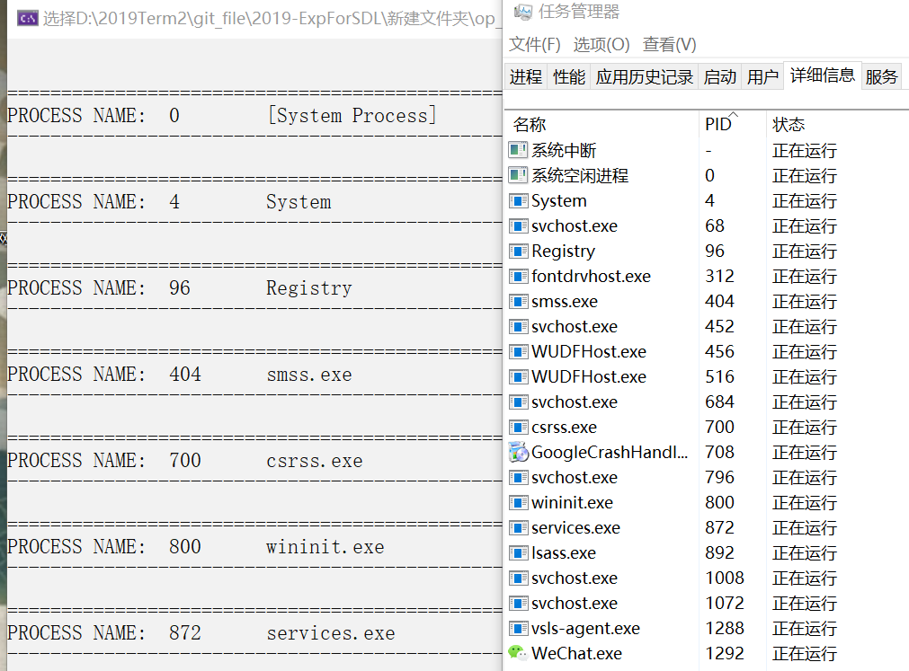
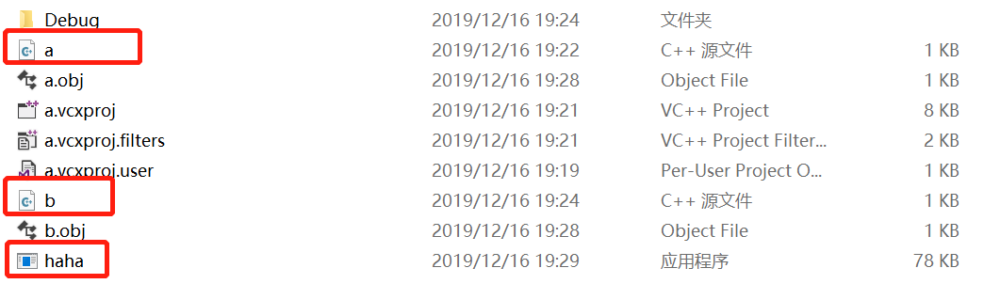

# 程序的注入技术

### 解释

用一个程序篡改其他程序的行为。

### 进程process

- 所有的程序执行时候的系统管理对象。
- 程序执行必然要以进程形式存在，所以进程是程序的进行时。
- 程序也有非运行状态。
- 任务管理器有进程的详细信息。

### 小实验

运行记事本，任务管理器中会多一个进程；右键结束进程，记事本关闭。

### 实验目标

通过其他办法脱离调试器来做软件篡改。

### 实验步骤

#### 一、遍历所有进程

网址：https://docs.microsoft.com/zh-cn/windows/win32/toolhelp/taking-a-snapshot-and-viewing-processes

- 给系统做快照，是专门对正在运行的程序的快照。（可以认为是链表头）
- 然后开始从链表中把节点遍历出来。
- PROCESSENTRY32：重要结构体。

在 VS 中调试运行，一直到可以显示为止。

什么是模块？

- 所有exe公用的API，做成dll的形式。
- 可执行程序在运行的时候需要模块支持。

#### 二、模块注入

动态链接库DLL：

- https://docs.microsoft.com/en-us/previous-versions/visualstudio/visual-studio-2008/1ez7dh12(v=vs.90)

- 链接：把若干个程序的组成部分拼接在一起。组成一个整体。

- 实验：将a.cpp和b.cpp链接成一个可执行文件。

  

- obj文件和lib文件都可以拼接（link）成一个可执行程序，这个拼接过程叫做链接。
- 静态链接是指，源代码编译完成的指令位于exe内部，编译完成后地址固定下来，地址相对静止，距离不变；动态链接是指，指令不在exe内部，需要在运行时导入，地址距离不确定。
- 拼接原理：exe调用了dll中的某个函数，因为是不同的两个文件，所以要传递一些信息，告诉函数在哪里。
- 所有现代操作系统必备，保证基础代码只有一个拷贝。

下载工具：

- process explorer（就是今天的代码为基础）
- dependency walker

**今天的小作业：**

- **综合使用今天学习的模块遍历，结合三个工具（dumpbin、process explorer、dependency），把其功能结合起来分析进行比较。（已经下载并解压到D盘）**

- **如何自己编写dll？使用dll来进行攻击。**

如何编写dll？

- https://docs.microsoft.com/en-us/cpp/build/reference/module-definition-dot-def-files?view=vs-2019

- 照着如下命令：

  

- 修改属性：

  

  

- 建一个exe调用刚才生成的库，并将dll放到exe同目录下：

  

  

#### 三、总结

核心：def文件、link的选项、lib加入输入文件进行链接。

#### 四、另外的方法调用API函数：显式调用

使用函数指针。

例子：https://docs.microsoft.com/zh-cn/windows/win32/dlls/using-run-time-dynamic-linking

**作业：**

- **会编写dll，把.c文件编译为obj文件，把obj文件和lib文件链接为新的dll和lib文件。**
- **编写一个exe调用第一步生成的dll文件中的导出函数，注意使用def文件定义导出函数。方法是（1）link时将第一步生成的lib文件作为输入文件；（2）保证dll文件和exe文件在同一目录下，或者dll文件在系统目录；**
- **第二步的调用方式称为load time，特点是exe文件导入表中会出现需要的调用的dll名和函数名，并且在link生成exe时需明确输入lib文件。还有一种调用方式称为run time，参考上面的链接，使用run time的方式调用dll的导出函数，包括系统api和第一步自行生成的dll，都要能成功调用。**
- **（提示：link /dll /def:xxx.def   link xxx.lib /out:app.exe   dumpbin /imports xxx.exe   dumpbin /exports xxx.dll）**

仔细读文档，就是上面的这个run time例子。

### 参考资料

