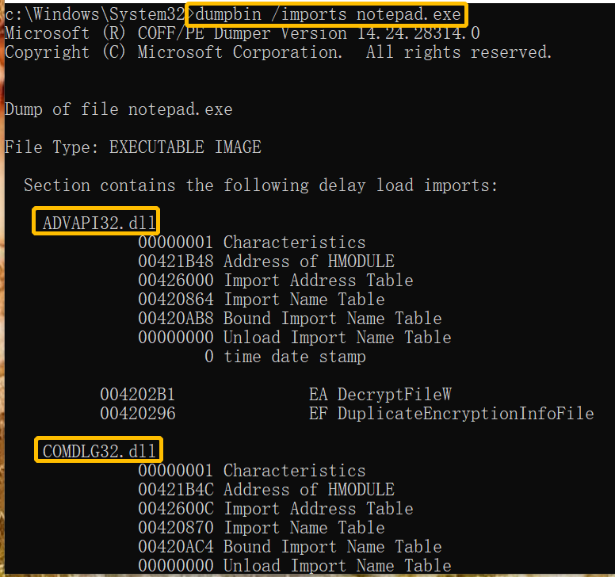
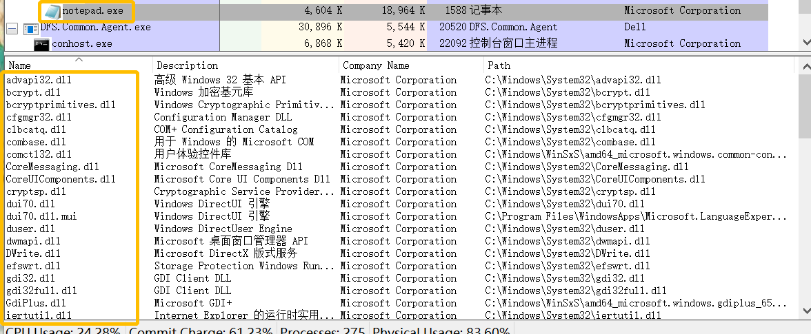
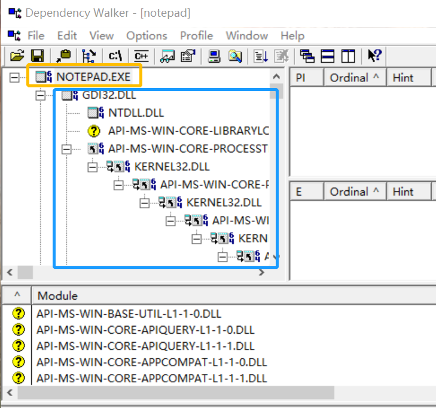
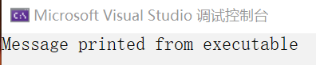
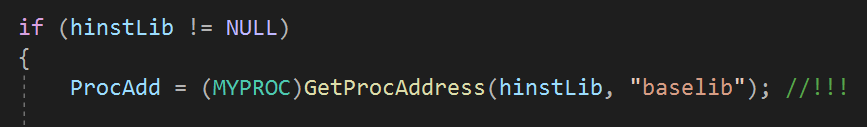
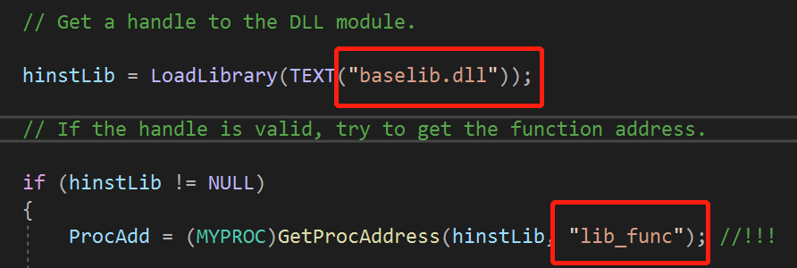
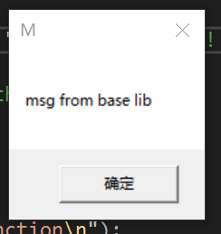

### 说明

- 课堂上的实验已经跟着老师做完了，实验记录也写在另一个 markdown 文件里。
- 这个文件的内容是完成老师上课布置的且没有演示过的作业。

### 实验目标

1. 使用 dumpbin、process explorer、dependency，将它们的功能结合起来进行分析比较；

2. 使用 run time 调用 dll 的导出函数，包括系统 api 和第一步自行生成的 dll，都要能成功调用。

   提示：使用函数指针，例子 https://docs.microsoft.com/zh-cn/windows/win32/dlls/using-run-time-dynamic-linking

### 第1个目标的实验步骤

使用 dumpbin 查看记事本：

使用 process explorer 查看记事本：

使用 depends 查看记事本：

分析比较。

- dumpbin
  - 显示 dll 名称、地址等；
  - 查找特定 dll 比较困难，无法辨别每个 dll 是用来做什么的；
  - 显示地址详细，显示 dll 非常迅速。

- process explorer
  - 显示 dll 名称、描述、来源公司、路径；
  - 易于识别 dll 的来源和用途，但也就这么点儿方便了；
  - 麻烦的地方在于，必须启动 exe 后才能显示其 dll。

- dependency walker
  - 显示 dll 名称、调用关系、dll 调用的函数等；
  - 三种方式里唯一可以判断 dll 间关系的；
  - 缺点是打开文件需要一段时间。

### 第2个目标的实验步骤

学习上面的例子。

- 函数 LoadLibrary 获得 dll 句柄，返回的句柄在函数 GetProcAddress 里，得到 dll 的地址，调用 dll 函数后，调用函数 FreeLibrary 来卸载 dll。
- 因为程序使用 run time 动态链接，不需要引入库函数来链接模块。
- run time 和 load time 的区别是，如果 dll 不可以获得，使用 load time 的应用将终止，而使用 run time 的应用可以响应错误。

运行这个例子里所给的代码。

说明 dll 没有被调用，怎么办？

- 经调试，ProcAdd一直为空：

  

- 修改例子中的参数有误，重新改正如下：

  

  