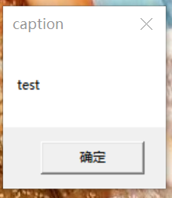

# DLL 劫持

### DllMain

https://docs.microsoft.com/zh-cn/windows/win32/dlls/dllmain?redirectedfrom=MSDN

### loader.c（在RunTime下）

WINAPI：保证调用方式一致。

### 代码注入技术

效果

- 对已知程序进行攻击。

方法

- 让已经编写完成的一个成熟软件，通过让这个软件加载动态链接库，实现修改这个软件的功能。

如果当前目录下没有 dll，就去系统目录下找。

- 黑客可以使浏览器调用虚假 dll，虚假 dll 可以调用正常的系统 dll，这就叫 **dll 劫持（dll inject）**。
- dll 劫持的7个例子：https://github.com/fdiskyou/injectAllTheThings

### 第一个例子：CreateRemoteThread()

https://docs.microsoft.com/zh-cn/windows/win32/api/processthreadsapi/nf-processthreadsapi-createremotethread?redirectedfrom=MSDN

```c
`HANDLE CreateRemoteThread(`
  `HANDLE                 hProcess,`
  `LPSECURITY_ATTRIBUTES  lpThreadAttributes,`
  `SIZE_T                 dwStackSize,`
  `LPTHREAD_START_ROUTINE lpStartAddress,`
  `LPVOID                 lpParameter,`
  `DWORD                  dwCreationFlags,`
  `LPDWORD                lpThreadId`
`);`
```

只要知道一个进程的 PID，就可以注入 DLL。

编程也可知道 PID，用函数 process32First 和 process32Next：https://docs.microsoft.com/zh-cn/windows/win32/toolhelp/taking-a-snapshot-and-viewing-processes

**作业**

- 把该例子中的函数查一下，自己简单运行一下。（具体见“课后作业及实验.md”）

# API hook

把系统的函数替换为伪造的函数，实现对系统行为的监控、修改。

### 重点内容

- IAT hook 是API hook的一种，API hook是通过修改函数的地址从而达到篡改程序行为的一种技术。
- IAT : 导入地址表
- hook技术通常与注入技术配合使用。

使用 PE explorer：


可以解析 PE 文件的工具： dumpbin /headers 、 PE explorer

### IAT hook

能解析 PE 文件是因为结构是公开的，黑客也可以编一个程序去解构 PE 文件。

去替换 IAT 表中原本存在的真实函数地址，使得程序在调用函数时，调用了一个假函数。

示例代码：https://github.com/tinysec/iathook

- 将示例代码中的 main.c 和 IAThook.c 建为一个工程，并链接。

  

- 运行发现有两个窗口。

  



### 大作业

- hook writefile，使得每次写文件时 hahaha 变成 hehehe。
- 将上述功能改为 dll。
- 注入到 notepad 进行 hook 并实验是否成功。
- find first file：注入 cmd，当使用 dir，遍历到 hacker.exe 时，不显示。
- tasklist 无法遍历到 hacker.exe。
- 实现屏幕取词。
- 接管其他进程的键盘输入，比如读取微信的文本框内容，发送到网络。
- **综合应用，实现对系统行为的篡改。**

