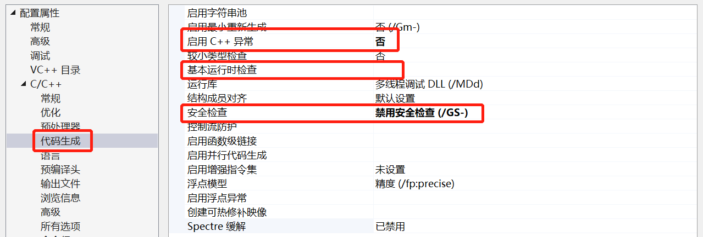
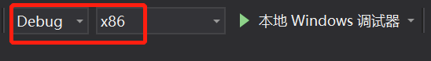
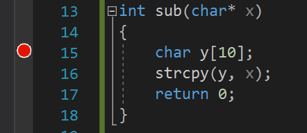

# 漏洞利用实验报告

### 实验步骤

- 新建项目，填入以下代码：

  ```c
  #define _CRT_SECURE_NO_WARNINGS
  
  #include <stdlib.h>
  #include <stdio.h>
  #include <string.h>
  
  int hacked()
  {
  	printf("hacked!!");
      return 0;
  }
  
  int sub(char* x)
  {
  	char y[10];
  	strcpy(y, x);
  	return 0;
  }
  
  char ov[40] = "123412351236123712381239123a123b123c";
  
  int main(int argc, char** argv)
  {
  	if (argc > 1)
  		sub(ov);
  	printf("exit");
  }
  ```

  hacked()函数并没有被调用，本实验的目的就是利用漏洞使它被调用，从而显示出“hacked!!”字样。

- 修改属性，使“启用C++异常”“基本运行时检查”“安全检查”全部为否。

  

- 调试环境为“debug x86”。

  

- 在sub()函数处下断点，并开始调试。

  

